### Introduction

This project is a continuation of Ekaterina Loginova's attempt to visualize the learning ability of question answering neural networks. See her introduction video [here](https://vimeo.com/272708264).

The webapp is comprised of 2 parts. The webapp compiles the charts from model output.
Each of the 2 models have their own project and output their data as REST APIs ([Keras model](https://github.com/dlordtemplar/keras-base-rest) and the
[Torch model](https://github.com/dlordtemplar/torch-insuranceQA-rest)). Due to the memory constraints of keeping large
models in memory, separating each model to their own project allows the user to compare output from multiple models
simultaneously, given they have enough resources to deploy all models at once. If not, then models can be turned on and 
off at will. Otherwise, loading one model into memory at a time seems to be the limit for most consumer PCs at this time.

#### About

The About section gives a short overview of the model used and references the previous work done by Ekaterina Loginova.

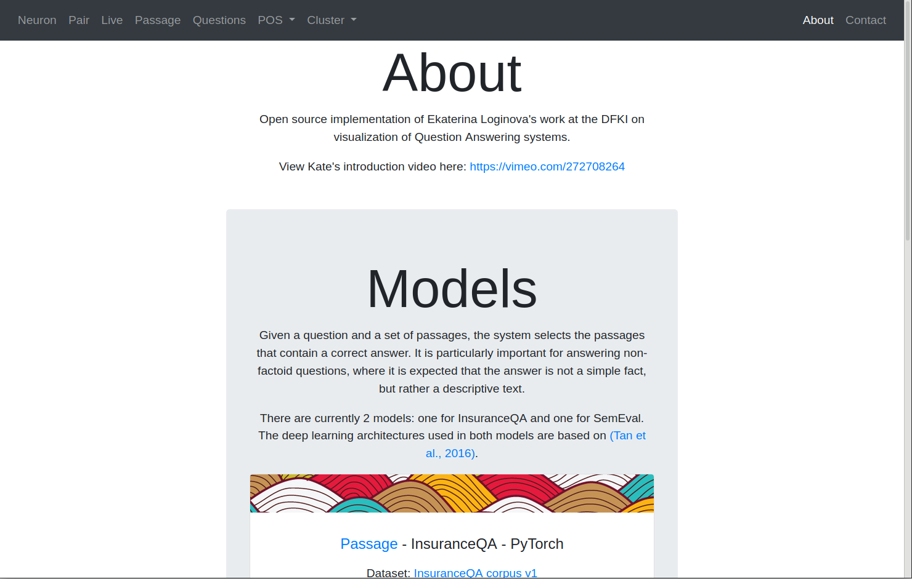

#### Neuron

The Neuron page shows the attention scores of a question-answer pair for a single neuron.
It is the initial step to see if individual neurons pay attention to some features over others.

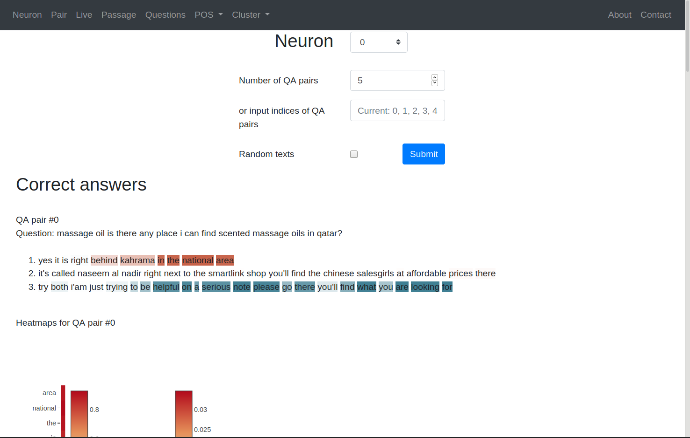

Clicking on the heatmap opens a modal with a more detailed view.

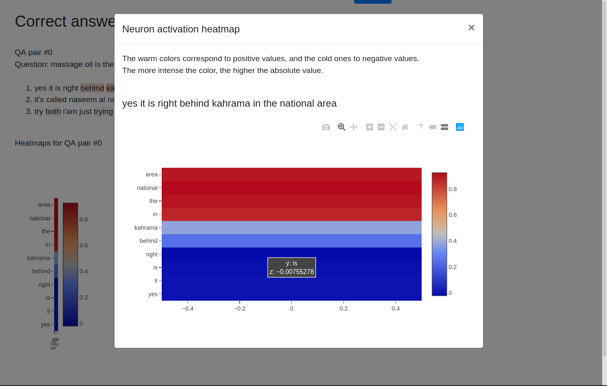

#### Pair

The Pair page shows the model's prediction of correct and incorrect answers along with the question in a t-SNE plot.
The hypothesis was whether correct answers would be "close" or cluster around each other or the question.

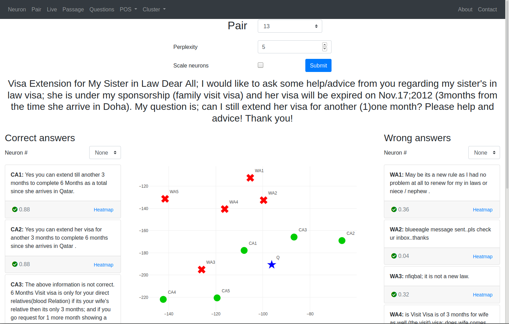

Clicking on heatmap link opens a modal with a heatmap showing the attention scores of each neuron for a single QA pair.
This is an attempt to see if neurons that showed similar activation scores were similar and could be clustered together.

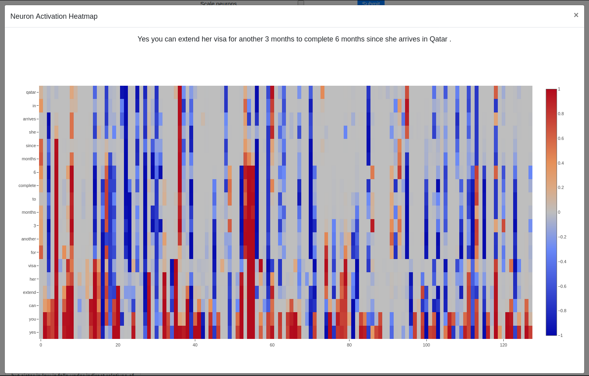

#### Live

The Live page is an extension of the Pairs page, except it allows the user to input their own questions and answers
to the model. Alternatively, the user can load a training sample.

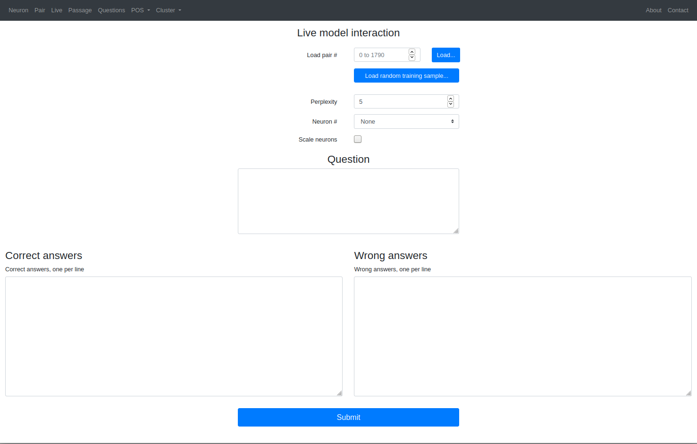

Sample output when loading one question-answer pair from the training dataset.

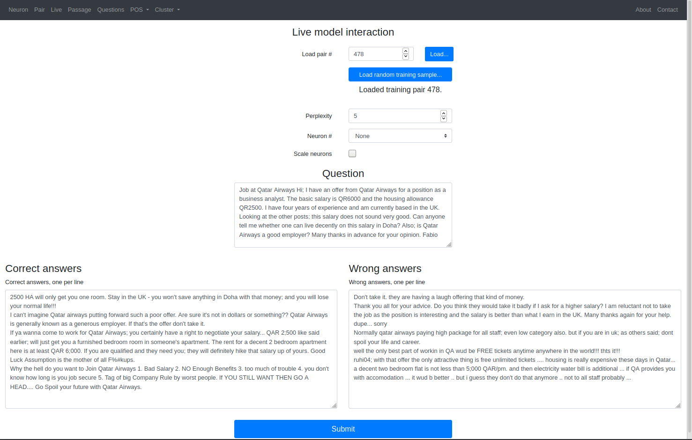

#### Passage

The Passage page uses the torch model and shows an evaluation of a separate QA system on a separate dataset.
This is not directly related to the other pages but is kept for posterity.

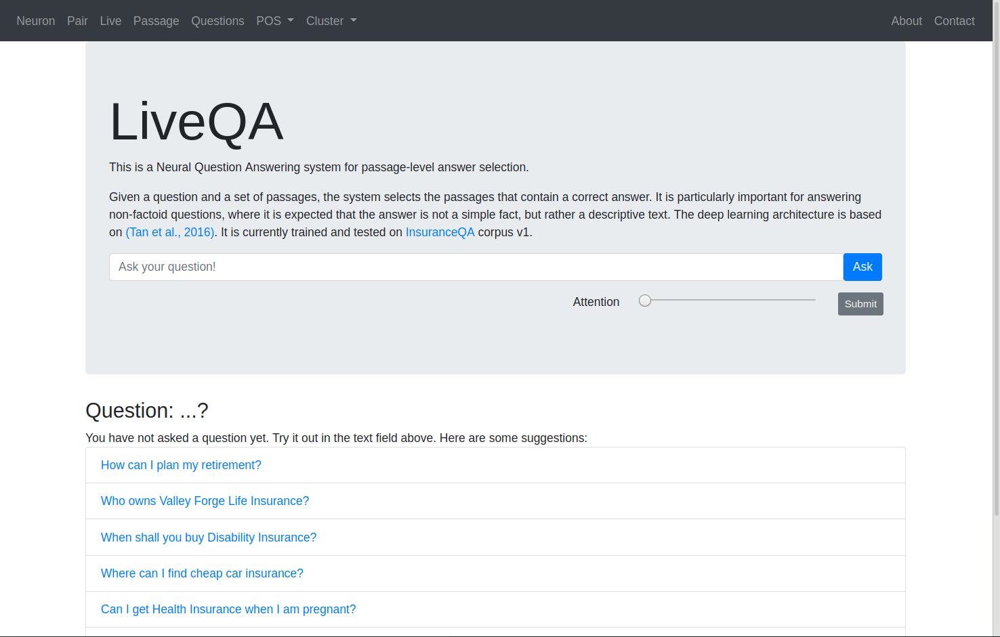

Sample output when selecting one of the sample questions from the landing page.

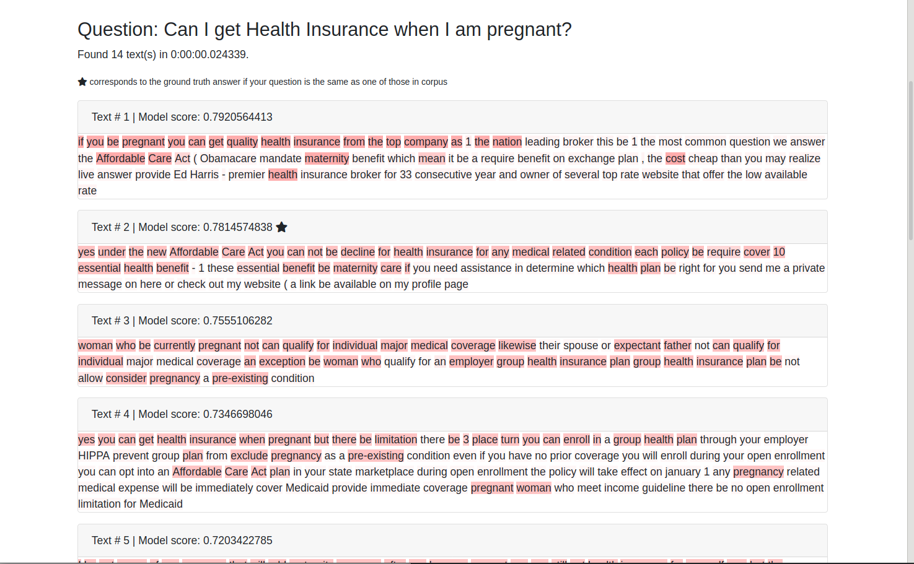

#### Questions

The Questions page shows all the questions in the training dataset in a t-SNE plot. The hypothesis was to see if similar
questions would cluster together, such as who-what-when-where-why-how. However, there may be an implementation error here,
as the questions do not show any discernible pattern.

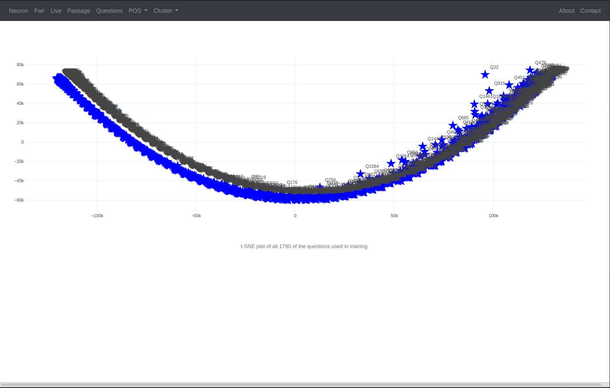

The user can zoom in and hover over each point to see a truncated version of the question.

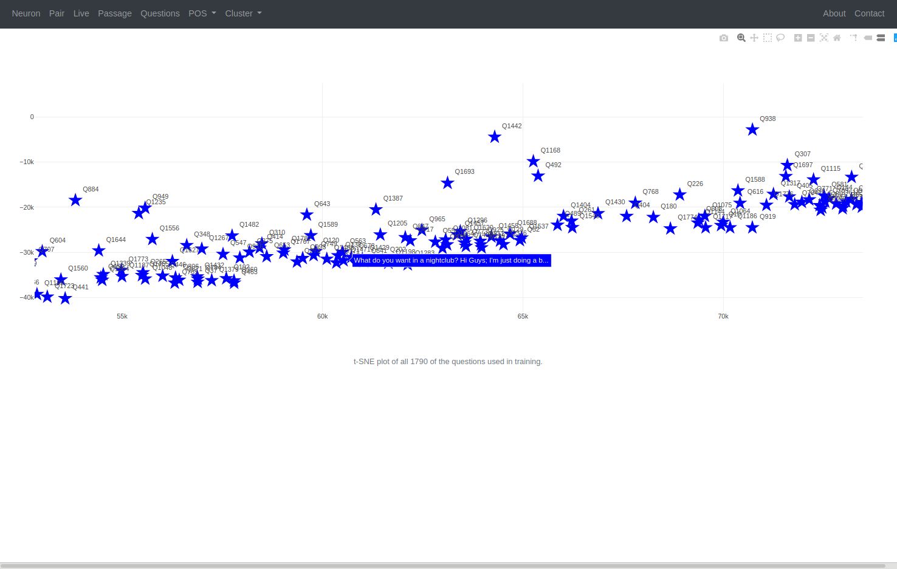

#### POS

The Parts of Speech (POS) pages show the percent values of a neuron's activation scores to certain POS tags. The hypothesis
was whether our model would inherently learn POS without being explicitly taught. Ideally neurons that revealed similar
activations could be clustered.

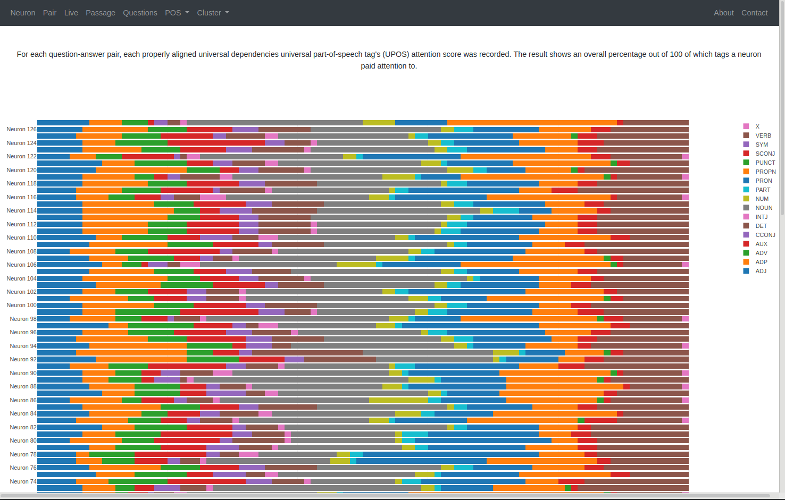

#### Cluster

The Cluster pages show all the neurons in a t-SNE plot (at varying perplexities) based on their activation scores for all QA pairs in the training
dataset. The hypothesis was trying to see if neurons clustered together into different areas of a "brain". Different
clusters would ideally analyze different features. However, no such cluster(s) were found this way.

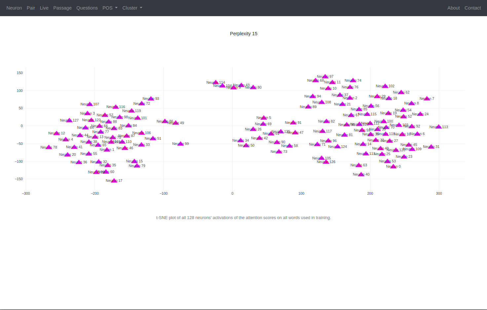

### Requirements

Client (This web interface)
- wtforms
- requests
- Flask

[Keras model](https://github.com/dlordtemplar/keras-base-rest) (Neuron, Pair)
- flask
- hunspell (Requires python-dev and libhunspell-dev. Install with 'sudo apt-get install libhunspell-dev')
- numpy
- editdistance
- gensim
- keras
- nltk
- pandas
- scikit-learn
- spacy (You will need to get the English model: "python -m spacy download en")
- tensorflow-gpu (NOT tensorflow. You need the GPU. [Install 1.12.0 for CUDA 9.0, and 1.13.0 for CUDA 10.0](https://www.tensorflow.org/install/source#tested_build_configurations))

[Torch model](https://github.com/dlordtemplar/torch-insuranceQA-rest) (Passage)
- flask
- spacy
- numpy
- torch
- pandas
- nltk
- gensim
- pyenchant (Can be replaced by pyhunspell)
- scikit_learn
- spacy (You will need to get the English model: "python -m spacy download en")

### Setup

This project is the client that fetches information from the two models that serve as REST APIs. Set up the two models:

[Keras model](https://github.com/dlordtemplar/keras-base-rest)

[Torch model](https://github.com/dlordtemplar/torch-insuranceQA-rest)

Then, "flask run --port 5002" with the values below

    FLASK_APP=flaskr
    FLASK_ENV=development

